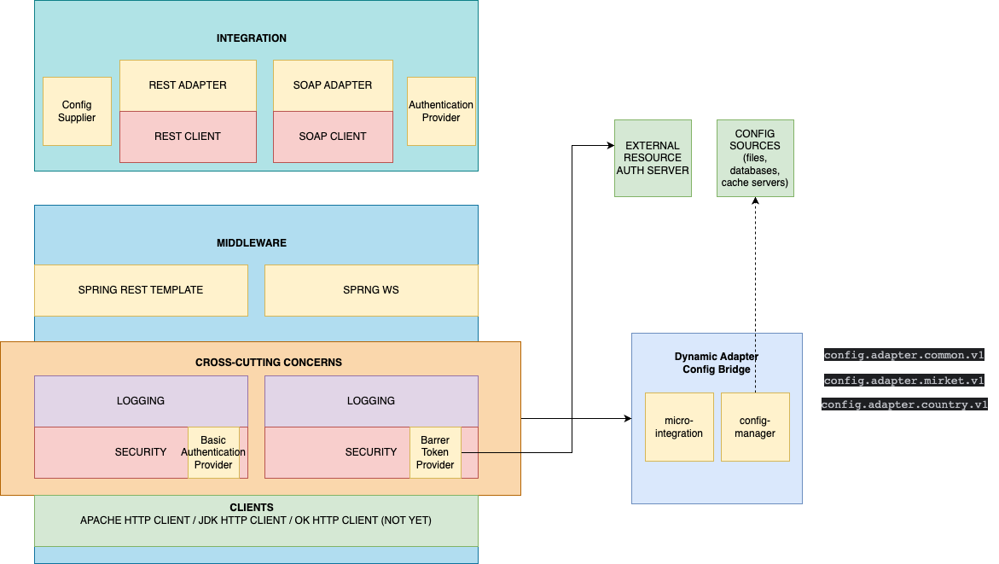

# Backend/Infra Services Adapters Libraries

The adapter serves backend/infra system services as a library.

You can use the library just giving the http client with your suitable configuration.

The library handles the adapter integration layer works such as data modeling, exception handling,
http rest/soap protocol complexities.

**IMPORTANT NOTE:** The doc should be updated when doing implementation.

## Architecture

High Level Diagram



## Issues

## TODO LIST

 - Add ssl forge
 - Add maven central repository (snapshot and release)

## Advantages

* Data Adapter Response Model pattern utilization (re-usability)
* REST/SOAP Exception Handling pattern utilization (re-usability)
* Layering/Abstraction of integration
* Standardizing integrations
* Increase development productivity
* Please add any one of them when using...

## Libraries

There are two levels of library layers for now.

### micro-integration

The top of the integration layer of the microservice.
There is no dependency without JDK.
The layer consists of interfaces, models, utilities and related stuffs.

### micro-middleware

The second layer of the integration architecture.
It consists of the abstractions of integration parts such as http client, spring-ws-core, javax
validation, apache common utility libs.

security, logging, client implementation

## Example adapter implementation

mirket-adapter is the sample adapter implementation.
Please check the implementation of the features before asking any questions.

## Protocols

### REST

Apache HttpClient 5

### SOAP

### Generation (WSDL2JAVA)

One of following optionals is for generation. (Choose one of them what your comfort-zone is)

    Apache CXF (optional)
    AXIS (optional)
    GRADLE JAXB Plugin (Optional)    
    JDK 17

Stubs are generated via apache cxf library using sh script or gradle task.

You can find the example shell scripts under the files/scripts directory.

You can generate client three ways.
There are shell scripts under the files/scripts folder that are to provide generating wsdl to java
code using axis/cxf.

* 1 - apache cxf

  Download apache binary dist.
  Config sh script variable values with your path configs
  Execute sh or bat scripts.

* 2 - axis2

  Download apache binary dist.
  Config sh script variable values with your path configs
  Execute sh or bat scripts.

Enabling axis dependencies please add following dependencies to gradle file.
mirket-adapter has an example of the axis generation.

    //axis
    implementation "org.apache.axis2:axis2:${versions.axis2}"
    implementation "org.apache.axis:axis-jaxrpc:${versions.axis2_jaxrpc}"
    implementation "org.apache.axis2:axis2-saaj:${versions.axis2}"
    implementation "org.apache.axis2:axis2-codegen:${versions.axis2}"
    implementation "org.apache.axis2:axis2-adb-codegen:${versions.axis2}"
    
    // axis
    axis "org.apache.axis2:axis2:${versions.axis2}",
    "org.apache.axis:axis-jaxrpc:${versions.axis2_jaxrpc}",
    "org.apache.axis2:axis2-codegen:${versions.axis2}",
    "org.apache.axis2:axis2-adb-codegen:${versions.axis2}",
    "javax.activation:activation:${versions.javax_activation}"

* 3 - gradle jaxb task(will be added) nad gradle axis (genCountryInfoService)

Recommend third way. It is more easy and minimum dependency.

    Gradle clean/build
    Execute genXXX task.

#### Rest Layer

    Spring rest template
    Apache HttpClient 5
    JDK Http Client

#### WS Layer

    Spring webservice template
    Apache HttpClient 5

## External Adapter (Backend service) Response Pattern

The generic code of the segmentation should be finalized.

The codes in the templates below are given as an example.

```json
{
  "status": {
    "code": "0",
    "message": "Success"
  },
  "data": {
    //generic type "T"
    //Any Object of server success response
  }
}
```

## Exception Cases

There are three phases to get error.

### client exception

```json
{
  "status": {
    "code": "4000",
    "message": "Adapter Client Message"
    // fixed message
  }
}
```

### server exception

code : it is originated from server response
message : it is originated from server response

```json
{
  "status": {
    "code": "5000",
    "message": "Server Message"
    //get from server
  }
}
```

### client exception after server response handling

```json
{
  "status": {
    "code": "4500",
    "message": "Server Response Message Client Handling Exception Message"
    // fixed message
  }
}
```

## Example Adapter Usage

- TODO: Create a template project to use it to create new adapter modules.
- TODO: Explain how to use an example adapter in user project. How to create beans etc.

## Example Adapter Service Creation

Since you need to write an integration code, there should be one class that manages all requests
that you need to send to that endpoint. To make it simple to write integration code, this library
provides two base adapter classes that you can extend in your integration service
class ```RestAdapter``` and ```SoapAdapter```.

Let's say that we have below services.

#### First Service Definition

| Property Name              | Value                                                 | Description                                   |
|----------------------------|-------------------------------------------------------|-----------------------------------------------|
| Service Name               | ExampleRestService                                    | User readable name of service                 |
| Service Type               | REST                                                  | Service api model                             |
| Service APIs               | /example-rest/first, /example-rest/first/any-sub-path | API urls that exposed by service              |
| Service Url                | https://api-gw.ourgw.com/example-rest                 | Main url of service that accessible from GW   |

#### Second Service Definition

| Property Name              | Value                                                   | Description                                   |
|----------------------------|---------------------------------------------------------|-----------------------------------------------|
| Service Name               | ExampleSoapService                                      | User readable name of service                 |
| Service Type               | SOAP                                                    | Service api model                             |
| Service APIs               | /example-soap/second, /example-soap/second/any-sub-path | API urls that exposed by service              |
| Service Url                | https://api-gw.ourgw.com/example-soap                   | Main url of service that accessible from GW   |

First you need to create your service class. After you create it you can override default methods to
gain some more control.

### Rest Service Usage

#### Creating the example service and overriding default methods:

```java
public class ExampleRestService extends RestAdapter<AdapterConfig> {

    // User can override this method to check the response status from the body of response. Sometimes
    // services can return an incorrect http status which means a response with a successful http
    // status but an error inside the body.
    @Override
    protected AdapterStatus checkStatusDefaultIsHttp200(HttpAdapterResponse<?> httpAdapterResponse) {
        final FirstServiceResponseContainer responseContainer = (FirstServiceResponseContainer) httpAdapterResponse.body();
        //check the body data for status, create business failed status if there is any error.
        if (responseContainer.checkSomeBusinessError()) {
            return new AdapterResponse<>(AdapterStatus.createStatusFailedAsBusiness());
        }
        return AdapterStatus.createSuccess();
    }

    //User can override this method to add endpoint level default exception handling.
    @Override
    protected <T> AdapterResponse<T> handleExceptionWithDefault(Exception e) {
        if (e instanceof SomeException) {
            //do something and return a different AdapterResponse.
        }
        return super.handleExceptionWithDefault(e);
    }

}

``` 

There are more detail about creation steps of example service in below. Let's create an api
integration method first.

#### How to send request to an endpoint

Use get,post,put,delete or patch method of RestAdapter to send request to the endpoint.

```java
public class ExampleRestService extends RestAdapter<AdapterConfig> {

    public AdapterResponse firstOperation(String firstOpParam) {
        final Map<String, String> headers = new HashMap();
        headers.put("X-Example-Header", "random-value");

        return get(
                "/first?firstOpParam=" + firstOpParam,
                // api sub url, this will be added to endpointConfig serviceUrl(gateway or direct)
                headers,  // headers
                null, // request body ( null for get request)
                FirstRestResponse.class,// response type 
                httpAdapterResponse -> { // response customizer callback.
                    final FirstRestResponse first = httpAdapterResponse.body();
                    if (first.checkSomeBusinessError()) {
                        return new AdapterResponse<>(AdapterStatus.createStatusFailedAsBusiness());
                    }
                    // you should map your response to your model and don't use Json library classes or generated response class dependent classes in your adapter response.
                    return new AdapterResponse<>(AdapterStatus.createSuccess(),
                            first.getTheDataYouWantToReturn());
                });
    }

}

``` 

### Soap Service Usage

#### Creating the example service and overriding default methods:

```java
public class ExampleSoapService extends SoapAdapter<AdapterConfig> {

    // User can override this method to check the response status from the body of response. Sometimes
    // services can return an incorrect http status which means a response with a successful http
    // status but an error inside the body.
    @Override
    protected AdapterStatus checkStatusDefaultIsHttp200(HttpAdapterResponse<?> httpAdapterResponse) {
        final SecondServiceResponseContainer responseContainer = (SecondServiceResponseContainer) httpAdapterResponse.body();
        //check the body data for status, create business failed status if there is any error.
        if (responseContainer.checkSomeBusinessError()) {
            return new AdapterResponse<>(AdapterStatus.createStatusFailedAsBusiness());
        }
        return AdapterStatus.createSuccess();
    }

    //User can override this method to add endpoint level default exception handling.
    @Override
    protected <T> AdapterResponse<T> handleExceptionWithDefault(Exception e) {
        if (e instanceof SomeException) {
            //do something and return a different AdapterResponse.
        }
        return super.handleExceptionWithDefault(e);
    }

}

``` 

There are more detail about creation steps of example service in below. Let's create an api
integration method first.


### How To Instantiate The Http Bean Configuration For The Adapter

```java
package com.inomera.middleware.config;

import com.inomera.integration.config.model.AdapterConfig;
import com.inomera.middleware.client.rest.ApacheHttpRestAdapterClient;
import com.inomera.middleware.client.rest.SimpleHttpRestAdapterClient;
import com.inomera.middleware.client.soap.ApacheHttpSoapAdapterClient;
import com.inomera.middleware.client.soap.SimpleSoapAdapterClient;
import org.apache.hc.client5.http.classic.HttpClient;
import org.springframework.context.annotation.Bean;
import org.springframework.context.annotation.Configuration;
import org.springframework.context.annotation.Scope;
import org.springframework.http.client.ClientHttpRequestFactory;
import org.springframework.oxm.Marshaller;
import org.springframework.oxm.Unmarshaller;
import org.springframework.ws.WebServiceMessageFactory;
import org.springframework.ws.transport.WebServiceMessageSender;

import java.util.function.Supplier;

/**
 * Configuration class for HTTP beans.
 */
@Configuration
public class HttpBeanConfiguration {

  public static final String BEAN_APACHE_HTTP_REST_CLIENT_WITH_CONFIG = "apacheHttpRestClientWithConfig";
  public static final String BEAN_APACHE_HTTP_REST_CLIENT = "apacheHttpRestClient";
  public static final String BEAN_APACHE_CUSTOM_HTTP_REST_CLIENT = "apacheCustomHttpRestClient";
  public static final String BEAN_APACHE_CUSTOM_CONFIG_HTTP_REST_CLIENT = "apacheCustomConfigHttpRestClient";
  public static final String BEAN_APACHE_HTTP_REST_CLIENT_WITH_REQUEST_FACTORY = "apacheHttpRestClientWithRequestFactory";
  public static final String BEAN_SIMPLE_HTTP_REST_CLIENT_WITH_CONFIG = "simpleRestHttpClientWithConfig";
  public static final String BEAN_SIMPLE_HTTP_REST_CLIENT = "simpleHttpRestClient";
  public static final String BEAN_SIMPLE_SOAP_CLIENT = "simpleSoapClient";
  public static final String BEAN_APACHE_HTTP_SOAP_CLIENT = "apacheHttpSoapClient";
  public static final String BEAN_APACHE_CUSTOM_HTTP_SOAP_CLIENT = "apacheCustomHttpSoapClient";
  public static final String BEAN_APACHE_HTTP_SOAP_CLIENT_WITH_MESSAGE_SENDER = "apacheHttpSoapClientWithMessageSender";
  public static final String BEAN_APACHE_HTTP_SOAP_CLIENT_WITH_MARSHALLER = "apacheHttpSoapClientWithMarshaller";
  public static final String BEAN_APACHE_HTTP_SOAP_CLIENT_WITH_MARSHALLER_AND_MESSAGE_FACTORY = "apacheHttpSoapClientWithMarshallerAndMessageFactory";


  //REST BEANS - <editor-fold desc="REST BEANS">
  @Scope("prototype")
  @Bean(BEAN_APACHE_HTTP_REST_CLIENT)
  public ApacheHttpRestAdapterClient apacheHttpRestAdapterClient() {
    return new ApacheHttpRestAdapterClient();
  }

  @Scope("prototype")
  @Bean(BEAN_APACHE_HTTP_REST_CLIENT_WITH_CONFIG)
  public ApacheHttpRestAdapterClient apacheHttpRestAdapterClientWithConfig(
          Supplier<AdapterConfig> configSupplierFunc) {
    return new ApacheHttpRestAdapterClient(configSupplierFunc);
  }

  @Scope("prototype")
  @Bean(BEAN_APACHE_CUSTOM_HTTP_REST_CLIENT)
  public ApacheHttpRestAdapterClient apacheCustomHttpRestAdapterClient(HttpClient httpClient) {
    return new ApacheHttpRestAdapterClient(httpClient);
  }

  @Scope("prototype")
  @Bean(BEAN_APACHE_CUSTOM_CONFIG_HTTP_REST_CLIENT)
  public ApacheHttpRestAdapterClient apacheCustomConfigHttpRestAdapterClient(
          Supplier<AdapterConfig> configSupplierFunc,
          HttpClient httpClient) {
    return new ApacheHttpRestAdapterClient(configSupplierFunc, httpClient);
  }

  @Scope("prototype")
  @Bean(BEAN_APACHE_HTTP_REST_CLIENT_WITH_REQUEST_FACTORY)
  public ApacheHttpRestAdapterClient apacheHttpRestAdapterClientWithReqFactory(
          Supplier<AdapterConfig> configSupplierFunc,
          ClientHttpRequestFactory clientHttpRequestFactory) {
    return new ApacheHttpRestAdapterClient(configSupplierFunc, clientHttpRequestFactory);
  }

  @Scope("prototype")
  @Bean(BEAN_SIMPLE_HTTP_REST_CLIENT)
  public SimpleHttpRestAdapterClient simpleHttpRestAdapterClient() {
    return new SimpleHttpRestAdapterClient();
  }

  @Scope("prototype")
  @Bean(BEAN_SIMPLE_HTTP_REST_CLIENT_WITH_CONFIG)
  public SimpleHttpRestAdapterClient simpleHttpRestAdapterClientWithConfig(
          Supplier<AdapterConfig> configSupplierFunc) {
    return new SimpleHttpRestAdapterClient(configSupplierFunc);
  }

  //SOAP BEANS - <editor-fold desc="SOAP BEANS">
  @Scope("prototype")
  @Bean(BEAN_SIMPLE_SOAP_CLIENT)
  public SimpleSoapAdapterClient simpleSoapAdapterClient(
          Supplier<AdapterConfig> configSupplierFunc, String marshallerContextPath) {
    return new SimpleSoapAdapterClient(configSupplierFunc, marshallerContextPath);
  }

  @Scope("prototype")
  @Bean(BEAN_APACHE_HTTP_SOAP_CLIENT)
  public ApacheHttpSoapAdapterClient apacheHttpSoapAdapterClient(
          Supplier<AdapterConfig> configSupplierFunc,
          String marshallerContextPath) {
    return new ApacheHttpSoapAdapterClient(configSupplierFunc, marshallerContextPath);
  }

  @Scope("prototype")
  @Bean(BEAN_APACHE_CUSTOM_HTTP_SOAP_CLIENT)
  public ApacheHttpSoapAdapterClient apacheCustomHttpSoapAdapterClient(
          Supplier<AdapterConfig> configSupplierFunc,
          HttpClient httpClient, String marshallerContextPath) {
    return new ApacheHttpSoapAdapterClient(configSupplierFunc,
            httpClient, marshallerContextPath);
  }


  @Scope("prototype")
  @Bean(BEAN_APACHE_HTTP_SOAP_CLIENT_WITH_MESSAGE_SENDER)
  public ApacheHttpSoapAdapterClient apacheHttpSoapAdapterClientWithSender(
          Supplier<AdapterConfig> configSupplierFunc, WebServiceMessageSender webServiceMessageSender,
          String marshallerContextPath) {
    return new ApacheHttpSoapAdapterClient(configSupplierFunc, webServiceMessageSender,
            marshallerContextPath);
  }

  @Scope("prototype")
  @Bean(BEAN_APACHE_HTTP_SOAP_CLIENT_WITH_MARSHALLER)
  public ApacheHttpSoapAdapterClient apacheHttpSoapAdapterClientWithMarshaller(
          Supplier<AdapterConfig> configSupplierFunc,
          WebServiceMessageSender webServiceMessageSender,
          Marshaller marshaller,
          Unmarshaller unmarshaller,
          String marshallerContextPath) {
    return new ApacheHttpSoapAdapterClient(configSupplierFunc,
            webServiceMessageSender, marshaller, unmarshaller, marshallerContextPath);
  }

  @Scope("prototype")
  @Bean(BEAN_APACHE_HTTP_SOAP_CLIENT_WITH_MARSHALLER_AND_MESSAGE_FACTORY)
  public ApacheHttpSoapAdapterClient apacheHttpSoapAdapterClientWitMarshallAndMsgFactory(
          Supplier<AdapterConfig> configSupplierFunc,
          WebServiceMessageSender webServiceMessageSender,
          Marshaller marshaller,
          Unmarshaller unmarshaller,
          WebServiceMessageFactory webServiceMessageFactory,
          String marshallerContextPath) {
    return new ApacheHttpSoapAdapterClient(configSupplierFunc,
            webServiceMessageSender, marshaller, unmarshaller, webServiceMessageFactory,
            marshallerContextPath);
  }


}


```


### Example Service Bean Configuration


Use get,post,put,delete or patch method of RestAdapter to send request to the endpoint.

```java
package com.inomera.mirketadapter;

import static com.inomera.middleware.config.HttpBeanConfiguration.BEAN_APACHE_HTTP_REST_CLIENT_WITH_CONFIG;
import static com.inomera.middleware.config.HttpBeanConfiguration.BEAN_APACHE_HTTP_SOAP_CLIENT;
import static com.inomera.telco.commons.config.spring.BeanNames.BEAN_CONFIGURATION_HOLDER;

import com.inomera.adapter.config.bridge.DynamicAdapterConfigDataBridgeSupplierHandler;
import com.inomera.integration.config.AdapterConfigDataSupplier;
import com.inomera.integration.config.model.AdapterConfig;
import com.inomera.middleware.client.rest.ApacheHttpRestAdapterClient;
import com.inomera.middleware.client.soap.ApacheHttpSoapAdapterClient;
import com.inomera.mirketadapter.rest.MirketAdapter;
import com.inomera.mirketadapter.rest.MirketAdapterImpl;
import com.inomera.mirketadapter.soap.CountryAdapter;
import com.inomera.mirketadapter.soap.CountryAdapterImpl;
import com.inomera.telco.commons.config.ConfigurationHolder;
import com.inomera.telco.commons.lang.Assert;
import generated.countryinfoservice.CountryInfoService;
import java.util.function.Supplier;
import org.springframework.boot.autoconfigure.condition.ConditionalOnClass;
import org.springframework.context.ApplicationContext;
import org.springframework.context.annotation.Bean;
import org.springframework.context.annotation.Configuration;

@Configuration
public class MirketAdapterBeanConfiguration {

  private static final String CONFIG_MIRKET_KEY = "config.adapter.mirket.v1";
  private static final String CONFIG_COUNTRY_KEY = "config.adapter.country.v1";

  final ApplicationContext applicationContext;

  public MirketAdapterBeanConfiguration(ApplicationContext applicationContext) {
    this.applicationContext = applicationContext;
  }

  @Bean
  @ConditionalOnClass(AdapterConfigDataSupplier.class)
  public MirketAdapter mirketAdapter(AdapterConfigDataSupplier adapterConfigDataSupplier) {
    Supplier<AdapterConfig> configSupplierFunc = () -> adapterConfigDataSupplier.getConfigV1(
            CONFIG_MIRKET_KEY);
    final ApacheHttpRestAdapterClient apacheHttpRestAdapterClient = (ApacheHttpRestAdapterClient) applicationContext.getBean(
            BEAN_APACHE_HTTP_REST_CLIENT_WITH_CONFIG, configSupplierFunc);
    Assert.notNull(apacheHttpRestAdapterClient, "Mirket ApacheHttpRestAdapterClient cannot be NULL");
    return new MirketAdapterImpl(configSupplierFunc, apacheHttpRestAdapterClient);
  }

  @Bean
  @ConditionalOnClass(AdapterConfigDataSupplier.class)
  public CountryAdapter countryAdapter(AdapterConfigDataSupplier adapterConfigDataSupplier) {
    Supplier<AdapterConfig> configSupplierFunc = () -> adapterConfigDataSupplier.getConfigV1(
            CONFIG_COUNTRY_KEY);

    final ApacheHttpSoapAdapterClient soapAdapterClient = (ApacheHttpSoapAdapterClient) applicationContext.getBean(
            BEAN_APACHE_HTTP_SOAP_CLIENT, configSupplierFunc, CountryInfoService.class.getPackage().getName());
    Assert.notNull(soapAdapterClient, "Country ApacheHttpSoapAdapterClient cannot be NULL");
    return new CountryAdapterImpl(configSupplierFunc, soapAdapterClient);
  }

  @Bean
  @ConditionalOnClass(ConfigurationHolder.class)
  public AdapterConfigDataSupplier adapterConfigDataSupplier() {
    final ConfigurationHolder configurationHolder = (ConfigurationHolder) applicationContext.getBean(
            BEAN_CONFIGURATION_HOLDER);
    Assert.notNull(configurationHolder, "ConfigurationHolder cannot be NULL");
    return new DynamicAdapterConfigDataBridgeSupplierHandler(configurationHolder);
  }
}


``` 

### Adapter General Usage Concerns

1. **Separate Models for Generated Code and MS Usage**  
   Models generated from external sources and those used within the microservice (MS) must be distinct.
  - For instance, request/response objects specific to the adapter should be created by developers within the adapter package.
  - Generated models (e.g., from WSDL/XSD) should not be directly used within the MS.

2. **Naming Standards for Adapter Models**
  - Models for the adapter must adhere to naming conventions. Any naming inconsistencies in the generated models must be corrected within the adapter layer.
  - Java naming conventions should be followed, and special characters should be avoided in field names.

3. **Adapter Abstraction and Customer Interfaces**
  - Beside the Soap/Rest Adapter (abstraction), a customer-specific interface for the microservice should be created.
  - For reference, see sample projects like `example/ms-example`.

4. **Constructor Consistency in Implementation Classes**
  - Ensure that all capabilities provided by constructors in the `SoapAdapter` class are implemented in the derived class.
  - These should ideally be achieved with all constructors.

5. **Integration Tests**
  - Comprehensive integration tests must be included.

6. **WSDL and XSD Files**
  - WSDL and XSD files must be placed under the `resources` directory.
  - Avoid referencing WSDL URLs directly in `build.gradle` files.

7. **Generated Files Placement**
  - Files generated for SOAP should be placed under a dedicated package with a `generated` prefix.
  - Example: Include these files outside the source code, within a package like `generated.<package_name>`.
  - This step is optional but ensures consistency and separation of concerns.


### Dynamic Config Definitions

Common Config

```json
{
  "key": "config.adapter.common.v1",
  "adapterProperties": {
    "logging": {
      "strategy": "REQ_RES",
      "sensitiveFields": [
      ],
      "nonLoggingFields": [
      ]
    },
    "headers": {
    },
    "http": {
      "requestTimeout": 30000,
      "connectTimeout": 10000,
      "idleConnectionsTimeout": 180000,
      "maxConnections": 10,
      "maxConnPerRoute": 10,
      "poolConcurrencyPolicy": "LAX",
      "timeToLive": 60000,
      "skipSsl": true,
      "redirectsEnable": true
    },
    "auth": {
      "type": "NONE"
    }
  }
}
```

Rest Adapter Config

```json
{
  "key": "config.adapter.mirket.v1",
  "adapterProperties": {
    "auth": {
      "type": "BEARER",
      "username": "username",
      "password": "password",
      "url": "https://www.googleapis.com/oauth2/v4/token",
      "grantType": "urn:ietf:params:oauth:grant-type:jwt-bearer",
      "ttl": 3600000,
      "scope": "https://www.googleapis.com/auth/cloud-platform",
      "clientId": "client_id",
      "clientSecret": "client_secret",
      "contentType": "application/x-www-form-urlencoded",
      "accept": "application/json",
      "tokenJsonPath": "$.access_token"
    },
    "headers": {
      "X-GW-TOKEN": ""
    },
    "http": {
      "requestTimeout": 30000,
      "connectTimeout": 10000,
      "idleConnectionsTimeout": 60000,
      "maxConnections": 50,
      "maxConnPerRoute": 50,
      "poolConcurrencyPolicy": "LAX",
      "timeToLive": 60000,
      "skipSsl": true,
      "redirectsEnable": true
    },
    "logging": {
      "strategy": "REQ_RES",
      "sensitiveFields": [
        "Authorization"
      ],
      "nonLoggingFields": [
        "file",
        "content"
      ]
    },
    "url": "https://api.mirket.inomera.com/v10/first"
  }
}
```

Soap Adapter Config

```json
{
  "key": "config.adapter.country.v1",
  "adapterProperties": {
    "logging": {
      "strategy": "REQ_RES",
      "sensitiveFields": [
        "Authorization",
        "X-GW-TOKEN"
      ],
      "nonLoggingFields": [
        "file",
        "content"
      ]
    },
    "url": "http://webservices.oorsprong.org/websamples.countryinfo/CountryInfoService.wso",
    "headers": {
      "SOAPAction": "CountryNameResponse"
    },
    "http": {
      "requestTimeout": 30000,
      "connectTimeout": 10000,
      "idleConnectionsTimeout": 60000,
      "maxConnections": 50,
      "maxConnPerRoute": 50,
      "poolConcurrencyPolicy": "LAX",
      "timeToLive": 60000,
      "skipSsl": true,
      "redirectsEnable": true
    },
    "auth": {
      "type": "BASIC",
      "username": "inomera",
      "password": "inomera"
    }
  }
}
```


